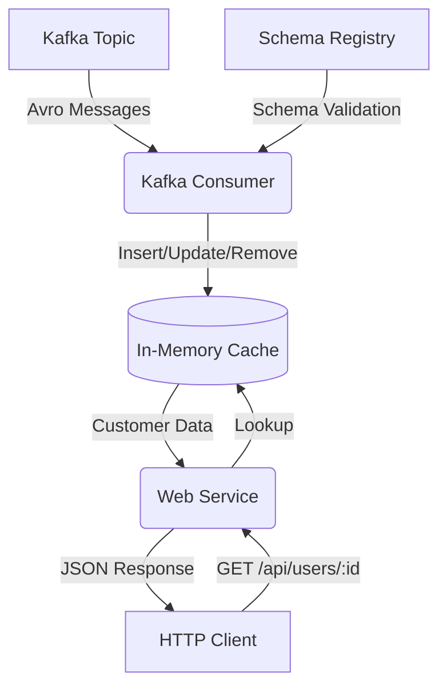

# Push Cache

[](https://github.com/PolecatWorks/push-cache/actions/workflows/backend-docker-publish.yml)

**Push Cache** is a high-performance, in-memory caching service written in Rust. It consumes customer data from a Kafka topic (Avro formatted) and exposes it via a fast HTTP API. It is designed to be a sidecar or microservice that provides low-latency access to eventually consistent data.

## Architecture

The service consists of two main components running concurrently:
1.  **Kafka Consumer**: Ingests `Customer` updates from a Kafka topic, deserializes Avro messages, and updates the in-memory cache. It handles "tombstone" records (null payload) by removing entries.
2.  **Web Service**: An Axum-based HTTP server that serves the cached data to clients.



## Data Structures

### Customer Model
The core data entity is the `Customer`.

| Field       | Type   | Description |
|-------------|--------|-------------|
| `accountId` | String | Unique identifier (Key) |
| `name`      | String | Customer Name |
| `address`   | String | Customer Address |
| `phone`     | String | Contact Phone |
| `createdAt` | i64    | Creation timestamp |
| `updatedAt` | i64    | Last update timestamp |

## API Reference

### Get Customer
Retrieves a customer by their Account ID.

- **URL**: `/api/users/{account_id}`
- **Method**: `GET`
- **Response**: `200 OK` (JSON) or `404 Not Found`
- **Headers**:
    - `Cache-Control`: public, max-age={config.seconds}
    - `ETag`: "{updatedAt}"

## Configuration

Configuration is handled via `figment` and can be supplied via a YAML file or environment variables (`APP_`).

| Section | Key | Default | Description |
|---------|-----|---------|-------------|
| **webservice** | `address` | `0.0.0.0:8080` | Bind address for the API |
| | `prefix` | `/api` | API path prefix |
| **kafka** | `brokers` | *Required* | Kafka bootstrap servers |
| | `group_id` | *Required* | Consumer group ID |
| | `topic` | *Required* | Topic name to consume |
| | `schema_registry_url` | *Required* | URL for Schema Registry |
| | `cache_max_age_seconds` | `300` | HTTP Cache-Control max-age |

Example `config.yaml`:
```yaml
webservice:
  address: "0.0.0.0:8080"
  prefix: "/api"

kafka:
  brokers: "localhost:9092"
  group_id: "push-cache-group"
  topic: "users"
  schema_registry_url: "http://localhost:8081"
  cache_max_age_seconds: 60
```

## Development

### Prerequisites
- Rust (latest stable)
- Kafka & Zookeeper (local or remote)
- Schema Registry
- `make`

### Quick Start
1. **Start dependencies** (in separate terminals or background):
    ```bash
    make start-zookeeper
    make start-kafka
    make start-schema
    ```

2. **Run the backend**:
    ```bash
    make backend-dev
    ```

### Testing
Run unit tests and doctests:
```bash
make backend-test
# OR directly:
cd backend && cargo test
```

### Docker Build
The project uses `cargo-chef` for optimized Docker layer caching.
```bash
make backend-docker
```

## Operations

- **Metrics**: Prometheus metrics are processed via `axum-prometheus`.
- **Health Checks**: Integrated via `libhams`.
- **Logging**: Structured logging via `tracing` and `tracing-subscriber`. Log level controlled via `CAPTURE_LOG` (default: WARN).

## External Libraries
- `libhams`: Custom library for service health and management. (Linking handled automatically in `build.rs`).
