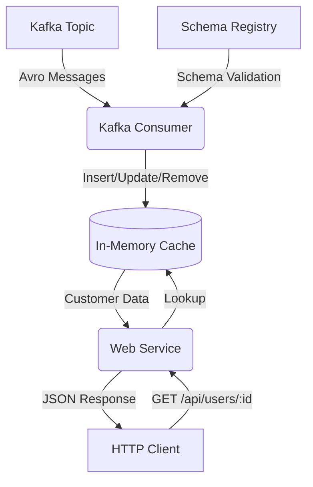

# Push Cache

[](https://github.com/PolecatWorks/push-cache/actions/workflows/helm-publish.yaml)

[](https://github.com/PolecatWorks/push-cache/actions/workflows/backend-docker-publish.yml)

[](https://github.com/PolecatWorks/push-cache/actions/workflows/backend-java-docker-publish.yml)

**Push Cache** is a high-performance, in-memory caching service written in Rust. It consumes customer data from a Kafka topic (Avro formatted) and exposes it via a fast HTTP API. It is designed to be a sidecar or microservice that provides low-latency access to eventually consistent data.

## Architecture

The service consists of two main components running concurrently:
1.  **Kafka Consumer**: Ingests `Customer` updates from a Kafka topic, deserializes Avro messages, and updates the in-memory cache. It handles "tombstone" records (null payload) by removing entries.
2.  **Web Service**: An Axum-based HTTP server that serves the cached data to clients.


```mermaid
graph TD
    K[Kafka Topic] -- Avro Messages --> C(Kafka Consumer)
    SR[Schema Registry] -- Schema Validation --> C
    C -- Insert/Update/Remove --> M[(In-Memory Cache)]

    Client[HTTP Client] -- GET /api/users/:id --> API(Web Service)
    API -- Lookup --> M
    M -- Customer Data --> API
    API -- JSON Response --> Client
```

### Eviction Strategy

The service does **not** implement an internal Time-To-Live (TTL) or Least Recently Used (LRU) eviction policy. Instead, it relies on **explicit upstream signals**:

-   **Tombstone Events**: Records are removed from the cache only when a "tombstone" event (a record with a null value) is received from the Kafka topic.
-   **Implication**: The upstream producer is responsible for managing the lifecycle of data. If the upstream does not send tombstones, the cache will grow indefinitely.

## Data Structures

### Customer Model
The core data entity is the `Customer`.

| Field       | Type   | Description |
|-------------|--------|-------------|
| `accountId` | String | Unique identifier (Key) |
| `name`      | String | Customer Name |
| `address`   | String | Customer Address |
| `phone`     | String | Contact Phone |
| `createdAt` | i64    | Creation timestamp |
| `updatedAt` | i64    | Last update timestamp |

### Additional Message Types

The system also supports these additional Avro message types for testing and development:

#### CustomerBill
Represents a customer billing statement.

| Field         | Type           | Description |
|---------------|----------------|-------------|
| `accountId`   | String         | Associated account ID |
| `year`        | i32            | Billing year |
| `totalAmount` | f64            | Total amount due |
| `payments`    | Vec\<Payment\> | List of payments made |

#### Payment (nested in CustomerBill)
| Field    | Type   | Description |
|----------|--------|-------------|
| `date`   | String | Payment date (RFC3339) |
| `amount` | f64    | Payment amount |
| `method` | String | Payment method |

#### UsageRecord
Tracks service usage by customers.

| Field         | Type   | Description |
|---------------|--------|-------------|
| `accountId`   | String | Associated account ID |
| `serviceType` | String | Type of service used |
| `amount`      | f64    | Usage amount |
| `unit`        | String | Unit of measurement (e.g., "GB") |
| `timestamp`   | i64    | Usage timestamp (milliseconds) |

#### SupportTicket
Represents a customer support ticket.

| Field       | Type   | Description |
|-------------|--------|-------------|
| `ticketId`  | String | Unique ticket identifier |
| `accountId` | String | Associated account ID |
| `issue`     | String | Issue description |
| `status`    | String | Current ticket status |
| `timestamp` | i64    | Creation timestamp (milliseconds) |

## API Reference

### Get Customer
Retrieves a customer by their Account ID.

- **URL**: `/api/users/{account_id}`
- **Method**: `GET`
- **Response**: `200 OK` (JSON) or `404 Not Found`
- **Headers**:
    - `Cache-Control`: public, max-age={config.seconds}
    - `ETag`: "{updatedAt}"

### Create Customer
Manually adds a new customer to the cache.

- **URL**: `/api/users`
- **Method**: `POST`
- **Body**: JSON object matching the `Customer` model.
- **Response**:
    - `201 Created`: Returns the created customer.
    - `409 Conflict`: If the user already exists.

### Delete Customer
Manually removes a customer from the cache.

- **URL**: `/api/users/{account_id}`
- **Method**: `DELETE`
- **Response**:
    - `200 OK`: Returns the deleted customer.
    - `404 Not Found`: If the user does not exist.

### List Customers (Keys)
Lists all customer keys (account IDs) in the cache. Supports pagination and filtering.

- **URL**: `/api/users`
- **Method**: `GET`
- **Query Parameters**:
    - `limit` (optional): Number of keys to return (default: all).
    - `offset` (optional): Number of keys to skip (default: 0).
    - `filter` (optional): Filter keys by substring.
- **Response**: `200 OK` with a JSON array of strings (keys).

## Configuration

Configuration is handled via `figment` and can be supplied via a YAML file or environment variables (`APP_`).

| Section | Key | Default | Description |
|---------|-----|---------|-------------|
| **webservice** | `address` | `0.0.0.0:8080` | Bind address for the API |
| | `prefix` | `/api` | API path prefix |
| **kafka** | `brokers` | *Required* | Kafka bootstrap servers |
| | `group_id` | *Required* | Consumer group ID |
| | `topic` | *Required* | Topic name to consume |
| | `schema_registry_url` | *Required* | URL for Schema Registry |
| | `cache_max_age_seconds` | `300` | HTTP Cache-Control max-age |
| **cache** | `stores` | *Required* | List of store definitions (in_memory, redis) |
| | `routes` | *Required* | List of route mappings to stores |

Example `config.yaml`:
```yaml
webservice:
  address: "0.0.0.0:8080"
  prefix: "/api"

kafka:
  brokers: "localhost:9092"
  group_id: "push-cache-group"
  topic: "users"
  schema_registry_url: "http://localhost:8081"
  cache_max_age_seconds: 60

cache:
  stores:
    - name: "mem"
      type: "in_memory"
      schemas: [] # Optional: filter specific schemas if needed
    # - name: "main_redis"
    #   type: "redis"
    #   url: "redis://localhost:6379"
    #   prefix: "cache"
  routes:
    - path: "/customers"
      store: "mem"

```

## Data Population

The repository includes a `populate_kafka` example tool for generating test data and publishing it to Kafka with proper Avro encoding.

### Features
- Supports multiple message types: `customer`, `bill`, `usage`, `ticket`
- Dynamic schema registration with Schema Registry
- Configurable topic and record count
- Statistics reporting (min/max/avg message sizes)
- Proper Avro encoding with magic byte and schema ID

### Usage

**Basic usage:**
```bash
cd backend
cargo run --example populate_kafka -- \
  --config test-data/config-localhost.yaml \
  --secrets test-data/secrets \
  --message-type customer \
  --count 100
```

**Generate different message types:**

```bash
# Generate customer records (default)
cargo run --example populate_kafka -- -c test-data/config-localhost.yaml -s test-data/secrets -m customer -n 100

# Generate billing records
cargo run --example populate_kafka -- -c test-data/config-localhost.yaml -s test-data/secrets -m bill -n 50

# Generate usage records
cargo run --example populate_kafka -- -c test-data/config-localhost.yaml -s test-data/secrets -m usage -n 200

# Generate support tickets
cargo run --example populate_kafka -- -c test-data/config-localhost.yaml -s test-data/secrets -m ticket -n 25
```

**Override topic:**
```bash
cargo run --example populate_kafka -- \
  --config test-data/config-localhost.yaml \
  --secrets test-data/secrets \
  --message-type customer \
  --topic custom-topic \
  --count 100
```

### CLI Arguments

| Argument | Short | Default | Description |
|----------|-------|---------|-------------|
| `--config` | `-c` | *Required* | Path to configuration YAML file |
| `--secrets` | `-s` | `secrets` | Directory containing secret files |
| `--message-type` | `-m` | `customer` | Message type: `customer`, `bill`, `usage`, or `ticket` |
| `--topic` | `-t` | From config | Override Kafka topic name |
| `--count` | `-n` | `100` | Number of records to generate |

### Makefile Shortcuts

For convenience, use the Makefile targets:

```bash
# Generate different types of test data
make populate-customers
make populate-bills
make populate-usage
make populate-tickets

# See all available populate targets
make populate-help
```

## Development

### Prerequisites
- Rust (latest stable)
- Kafka & Zookeeper (local or remote)
- Schema Registry
- `make`
- Docker & Docker Compose (optional, for running dependencies)

### Docker Compose

You can use Docker Compose to run the necessary infrastructure dependencies (Redis, Kafka, Zookeeper, Schema Registry). The `Makefile` provides convenient shortcuts:

```bash
# Start Redis
make compose-redis

# Start Kafka with Zookeeper (Standard)
make compose-kafka-zk

# Start Kafka in KRaft mode (Experimental/Newer)
make compose-kafka-kraft
```

### Quick Start
1. **Start dependencies** (in separate terminals or background):
    ```bash
    make start-zookeeper
    make start-kafka
    make start-schema
    ```

2. **Run the backend**:
    ```bash
    make backend-dev
    ```

### Testing
Run unit tests and doctests:
```bash
make backend-test
# OR directly:
cd backend && cargo test
```

### Docker Build
The project uses `cargo-chef` for optimized Docker layer caching.
```bash
make backend-docker
```

## Operations

- **Metrics**: Prometheus metrics are processed via `axum-prometheus`.
- **Health Checks**: Integrated via `libhams`.
- **Logging**: Structured logging via `tracing` and `tracing-subscriber`. Log level controlled via `CAPTURE_LOG` (default: WARN).

## External Libraries
- `libhams`: Custom library for service health and management. (Linking handled automatically in `build.rs`).

## Benchmarks

Single query performance of `DashState` (DashMap) with growing state sizes.

| State Size | Time (ns) | Trend |
| :--- | :--- | :--- |
| 100 | ~40.5 | Baseline |
| 1,000 | ~37.9 | Fast |
| 10,000 | ~56.1 | +48% |
| 100,000 | ~128.9 | +130% |
| 1,000,000 | ~267.1 | +107% |
| 5,000,000 | ~322.0 | +20% |
| **16,000,000** | **~350-400** | **Projected** |

To run benchmarks:
```bash
cargo bench --bench cache_benchmark
```

## Concurrent Benchmarks

Throughput with 1,000,000 entries and varying concurrency (Tokio tasks).

| Concurrency | Throughput (QPS) |
| :--- | :--- |
| 1 | ~52 K |
| 10 | ~290 K |
| 50 | ~450 K |
| 100 | ~1.2 M |
| 500 | ~1.5 M |
| **1000** | **~1.9 M** |

To run:
```bash
cargo bench --bench concurrent_benchmark
```

### Impact of State Size on Concurrency

Throughput with 100 concurrent tasks and varying state sizes.

| State Size | Throughput (QPS) |
| :--- | :--- |
| 100,000 | ~1.16 M |
| 1,000,000 | ~1.55 M |
| 5,000,000 | (Incomplete) |

### Insertion Performance

| Benchmark | Result | Notes |
| :--- | :--- | :--- |
| Single Insert Latency | ~167 ns | Overwrite existing key |
| Concurrent Insert Throughput | ~1.5 M QPS | 100 concurrent tasks |

To run insertions:
```bash
cargo bench --bench cache_benchmark -- insert_performance
cargo bench --bench concurrent_benchmark -- concurrent_insert_performance
```
