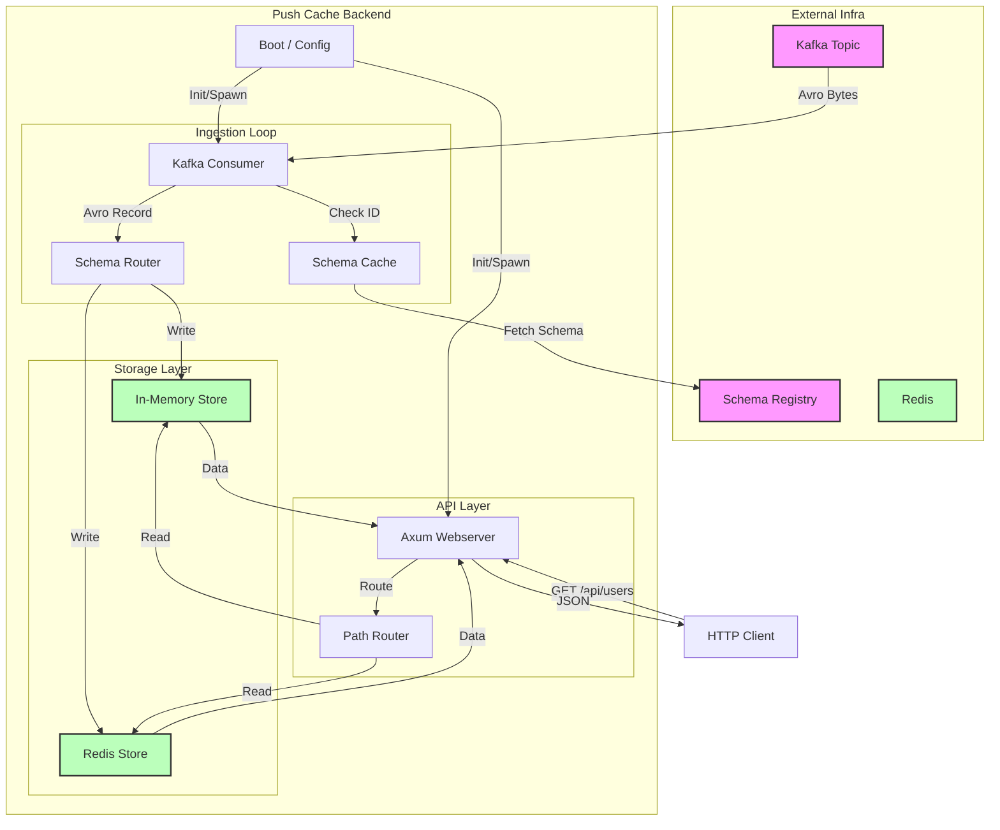

# Push Cache Backend - Technical Specification

This document provides a detailed technical overview of the `push-cache` backend service.

## 1. Overview

The backend is a high-performance, asynchronous Rust application designed to bridge the gap between high-volume Kafka data streams and low-latency HTTP read access. It acts as a sidecar/caching layer that eagerly consumes data from Kafka and makes it available via a RESTful API.

Key technical characteristics:
- **Asynchronous**: Built on `tokio` and `axum`.
- **Schema-Aware**: deeply integrated with Confluent Schema Registry and Avro.
- **Pluggable Storage**: Supports in-memory (`DashMap`) and Redis backends concurrently.
- **Health & Metrics**: Integrated health checks (`libhams`) and Prometheus metrics.

## 2. Architecture

The architecture follows a uni-directional data flow for writes (Kafka -> Cache) and a request-response model for reads (HTTP -> Cache).



### Component Breakdown

| Component | Responsibility | Implementation |
|-----------|----------------|----------------|
| **MyConfig** | Configuration loading & validation. | `src/config.rs`, `figment` |
| **MyState** | Shared global state (config, stores, metrics). | `src/lib.rs` (`Arc<MyState>`) |
| **Consumer** | Consumes Kafka messages, manages offsets. | `src/consumer.rs`, `rdkafka` |
| **Cache (Trait)** | Abstract interface for storage operations. | `src/cache.rs` |
| **Webserver** | Handles HTTP requests, exposes data. | `src/webserver/mod.rs`, `axum` |
| **Hams** | Health checks, metrics, administrative controls. | `libhams`, `src/hams.rs` |

## 3. Boot Sequence & Lifecycle

The application lifecycle is managed via `tokio` tasks and a `CancellationToken` for graceful shutdown.

1.  **Entry Point (`main.rs`)**:
    -   Parses CLI arguments (config path, secrets path).
    -   Initializes logging/tracing.
    -   Loads configuration via `MyConfig::figment`.
    -   Calls `service_start`.

2.  **Service Initialization (`lib.rs` -> `service_cancellable`)**:
    -   Creates a root `CancellationToken`.
    -   **`MyState::new()`**:
        -   Initializes Prometheus Metrics Registry.
        -   Runs **Startup Checks** (`startup_tools.rs`): Parallel checks for Schema Registry, Kafka Metadata, and Redis connectivity. Fails boot if critical checks fail.
        -   Initializes **Stores**: Creates instances of `InMemoryCache` or `RedisCache` based on config.
        -   Builds **Schema Routing Map**: Maps Avro schema fullnames to specific Store names.
    -   **Health Service (`Hams`)**:
        -   Spawns `Hams` in a blocking task (required for FFI compatibility).
        -   Registers internal probes (e.g., `lag-cleared`).
    -   **Kafka Consumer**:
        -   Spawns a Tokio task running `consumer::start_consumer`.
    -   **Webserver**:
        -   Starts the Axum server handling HTTP traffic.

3.  **Runtime**:
    -   The system runs until a signal (SIGINT/SIGTERM) is received or a critical error occurs.
    -   The `consumer` task continually polls Kafka.
    -   The `webserver` task handles incoming HTTP requests.

4.  **Shutdown**:
    -   `CancellationToken` is cancelled.
    -   Axum server begins graceful shutdown (stops accepting new connections, waits for pending).
    -   `Hams` service is stopped.
    -   Process exits.

## 4. Configuration to Implementation Mapping

The configuration structure directly dictates how the internal components are wired.

### Config Structure (`config.yaml`)

```yaml
cache:
  stores:
    - name: "mem"          # Internal reference name
      type: "in_memory"    # Implementation type
      schemas:             # List of Avro schema fullnames to route here
        - com.polecatworks.billing.Customer
  routes:
    - path: "/customers"   # URL path segment
      store: "mem"         # Reference to store name defined above
```

### Implementation Mapping

1.  **Store Initialization (`MyState::new`)**:
    -   Iterates over `config.cache.stores`.
    -   For `type: in_memory`: Creates `InMemoryCache`.
    -   For `type: redis`: Creates `RedisCache` (establishes connection pool).
    -   Result: `HashMap<String, Arc<dyn Cache>>` (Store Name -> Cache Instance).

2.  **Schema Routing (Ingestion)**:
    -   The `schemas` list in a store definition builds a reverse map: `schema_to_store: HashMap<String, String>` (Schema FullName -> Store Name).
    -   **Runtime**: When Consumer receives a message:
        1.  Extracts Schema ID -> Resolves Schema.
        2.  Gets Schema Fullname (e.g., `com.polecatworks.billing.Customer`).
        3.  Lookups `schema_to_store` to find target Store Name.
        4.  Lookups Store Instance.
        5.  Inserts data.

3.  **Path Routing (Access)**:
    -   The Webserver iterates `config.cache.routes`.
    -   For each route, it creates a nested Axum Router.
    -   Mounts the router at `base_path + route.path`.
    -   Injects the specific Store instance into the route's state (`RouteState`).
    -   **Runtime**: `GET /api/customers/:id` hits the router configured for `/customers`, which is bound to the `mem` store.

## 5. Data Ingestion Detail

The `consumer.rs` module handles the complexity of the "Confluent Wire Format" and Schema Registry.

1.  **Message Received**: Raw bytes from Kafka.
2.  **Magic Byte Check**: Ensures byte 0 is `0`.
3.  **Schema ID Extraction**: Bytes 1-4 are big-endian Schema ID.
4.  **Schema Cache Lookup**: Checks if Schema ID is known. If not, fetches from Schema Registry.
5.  **Tombstone Handling**: If payload is empty, it treats it as a delete (Tombstone) and removes the key from *all* stores.
6.  **Deserialization (Partial)**: The consumer *does not* deserialize the full Avro record body into a Rust struct. It keeps it as raw bytes or uses generic Avro `Value` only for validation/schema matching if needed. It stores the **raw bytes** (with magic byte/ID) into the cache to avoid serialization overhead.
    -   *Note*: The Webserver deserializes on read to convert to JSON.

## 6. Webserver & Endpoints

The webserver (`webserver/mod.rs`) provides a standard CRUD-like interface overlaid on the cache.

-   **`GET /:id`**:
    1.  Lookups raw bytes from Store.
    2.  Extracts Schema ID.
    3.  Resolves Schema.
    4.  Deserializes Avro bytes -> `apache_avro::types::Value`.
    5.  Serializes `Value` -> JSON.
    6.  Returns JSON response.

-   **`POST /:id`** (Manual Insert):
    -   Expects valid Confluent Wire Format raw bytes.
    -   Inserts directly into Store.

-   **`DELETE /:id`**:
    -   Removes from Store.
